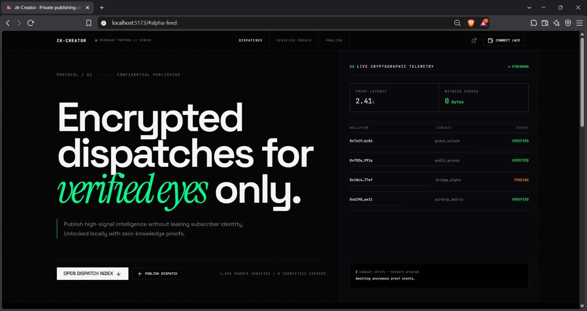

# NightGate: Zero-Knowledge Content Paywall

**Built for the Midnight Builderathon (Wave 1)**

[](https://midnight.network)
[](https://docs.midnight.network)
[-blue?style=for-the-badge)](https://www.lace.io/)
[](https://nightgate.netlify.app)

> **NightGate** (formerly zk-Creator) is a privacy-first Web3 decentralized application built on the **Midnight Network**. It allows creators to publish exclusive research, alpha reports, and digital goods behind a zero-knowledge paywall—enabling users to unlock and decrypt content locally without broadcasting their wallet address, financial balances, or on-chain identity to the public ledger.

---

## 🌐 Live Demo & Screenshots
**Try the live frontend here:** [nightgate.netlify.app](https://nightgate.netlify.app)  
*(Note: Requires the Lace Wallet extension connected to the Midnight Preprod network).*

**Deployed Preprod Contract:** `d9feb2468cb2325da4bb6709d5b278631d3f113fda43265a032d21db4cb066db`



---

## 🎯 The Problem

In today's Web3 ecosystem, "token-gated" content platforms (like Discord bots, Mirror, or Guild.xyz) suffer from a critical privacy flaw:
1. **Public Surveillance:** Unlocking gated content requires signing a message or making a transaction from a public wallet. This permanently links your real-world IP/identity to your on-chain financial portfolio and reading habits.
2. **Whale Phishing & Tracking:** High-net-worth investors, security auditors, and VIPs frequently avoid token-gated alpha because interacting with a public smart contract flags their wallet for tracking, targeted exploits, and spam.
3. **Identity Leaks for Sensitive Data:** Creators distributing sensitive research (e.g., zero-day vulnerability advisories, whistleblower leaks, or proprietary institutional research) have no way to verify qualified recipients without building a public, surveillance-ready list of everyone who accessed it.

---

## 🛡️ Our Solution: NightGate on Midnight

NightGate solves this dilemma by utilizing **Compact Smart Contracts** and local proving on the Midnight Network:

Instead of a public smart contract verifying your balance on-chain, NightGate flips the model. When a user requests access to content, their wallet passes their private state (balances, credentials) directly to a local prover running *inside their browser*. 

The browser generates a cryptographic Zero-Knowledge Proof (zkSNARK) that essentially states: *"I mathematically meet the creator's requirements to view this content, but I will not tell you who I am or what my exact balance is."*

This proof, alongside a completely anonymous cryptographic **Nullifier**, is submitted to the Midnight Ledger. The creator is guaranteed that the user is qualified, and the user enjoys 100% privacy.

### Key Innovations:
- **Zero Identity Disclosed:** The user's wallet address, token holdings, and private keys never leave their browser.
- **Nullifier Protection:** Midnight's `disclose(nullifier)` mechanism prevents replay attacks and double-spending while preserving total recipient anonymity.
- **Client-Side Proving:** Proving happens in the client environment, completely abstracting complex zkSNARK cryptography behind a clean, web2-like user experience.

---

## 🏗️ How We Built It (Architecture)

```text
[User Browser + Lace Wallet]
       │
       ▼ (1) Private Secret Derivation (Local WebCrypto Witness)
  user_secret: Bytes<32>
       │
       ▼ (2) Local Client-Side Proving (Midnight Prover / SNARK)
  Computes: nullifier = persistentHash(user_secret)
  Asserts:  nullifier not in spent_nullifiers
       │
       ▼ (3) Disclose ONLY Nullifier Hash & ZK Proof (0 bytes identity)
[Midnight Preprod Ledger]
  ├── spent_nullifiers.insert(nullifier, true)  ✅ Prevents double-unlock
  └── total_unlocks.increment(1)                ✅ Creator gets verified count
       │
       ▼ (4) On-Chain Proof Verified
[Content Decrypted Locally in User's Browser]
```

### The Compact Smart Contract
The core logic is written in Midnight's **Compact** language ([`contracts/zk_creator.compact`](zk-creator/contracts/zk_creator.compact)):

```rust
export ledger total_unlocks: Counter;
export ledger spent_nullifiers: Map<Bytes<32>, Boolean>;

export circuit unlock(user_secret: Bytes<32>): [] {
    // 1. Hash secret into a deterministic nullifier
    const nullifier = persistentHash<Bytes<32>>(user_secret);

    // 2. Disclose ONLY the nullifier to the public ledger
    const disclosed_nullifier = disclose(nullifier);

    // 3. Prevent double-claiming
    assert(!spent_nullifiers.member(disclosed_nullifier), 
           "This secret has already been used to unlock content");

    // 4. Update ledger state
    spent_nullifiers.insert(disclosed_nullifier, true);
    total_unlocks.increment(1);
}
```

---

## ✨ Features (What's in it right now)

- **Zero-Knowledge Unlocks:** Instantly synthesize ZK proofs in the browser using the Lace wallet without exposing the user's public address.
- **Visual Proving Lifecycle:** A terminal-style UI modal that displays real-time cryptographic stages (Witness extraction, constraint synthesis, SNARK generation) so users can understand the privacy mechanism.
- **Private Artifact Inspector:** A post-unlock view that showcases the decrypted content alongside zero-knowledge metadata (e.g., `Circuit Hash`, `Nullifier Hash`, and the fact that `0 Bytes` of identity were disclosed).
- **Midnight DApp Connector API:** Seamless integration with Lace wallet supporting `preprod`, `testnet`, and local fallback environments.
- **Production-Ready Frontend:** A beautiful, responsive, and dynamic UI built with React, Vite, TailwindCSS, and deployed globally via Netlify Edge.

---

## 🚀 What's Next (Roadmap & Upcoming Features)

While Wave 1 focuses on the core zk-proving frontend and single-contract architecture, our roadmap for NightGate is expansive:

1. **Multi-Asset Gating:** Allowing creators to gate content based on complex boolean logic (e.g., "Must hold 50 tNIGHT OR own X NFT").
2. **Encrypted Decentralized Storage Integration:** Storing the encrypted content payloads on IPFS or Arweave, where the decryption keys are only released by the smart contract upon successful ZK verification.
3. **Creator Analytics Dashboard:** Allowing creators to see *how many* users unlocked their content, and aggregated (but privacy-preserving) metadata about their audience, utilizing Midnight's shielded state.
4. **Subscription Paywalls:** Transitioning from one-time content unlocks to recurring, privacy-preserving subscriptions using time-locked nullifiers.
5. **Mobile Wallet Support:** Optimizing the ZK proving client for mobile environments as Midnight wallet ecosystem expands.

---

## 💻 Tech Stack

- **Zero-Knowledge Core:** Midnight Network, Compact Language (v0.23+), Midnight.js SDK
- **Wallet & Authentication:** Lace Wallet, Midnight DApp Connector API
- **Frontend Framework:** React 19, Vite, TanStack Router (SPA mode)
- **Styling:** TailwindCSS v4, Radix UI Primitives, Framer Motion (Animations)
- **Deployment & Hosting:** Netlify (Global CDN)

---

## 🛠️ Local Setup & Deployment

### Prerequisites
- Node.js v22 or later
- Lace Wallet browser extension
- (For Preprod) Access to the [Midnight Faucet](https://midnight-tmnight-preprod.nethermind.dev/)

### Installation

```bash
# Clone the repository
git clone https://github.com/Yash-Karakoti/NightGate.git
cd NightGate

# Install dependencies
npm install

# Run the frontend locally
npm run dev
```

### Smart Contract Deployment (Local / Preprod)

```bash
cd zk-creator

# Install contract dependencies
npm install

# Compile the Compact contract
npm run compile

# Deploy the contract to Preprod
# (Ensure your local .midnight-state.json is funded via the faucet first)
npm run deploy -- --network preprod
```

### Running Contract Tests
```bash
npm run test
```
*The test suite verifies the contract structure, ensures duplicate nullifiers are rejected, and validates the privacy invariants (raw secrets are never disclosed).*
